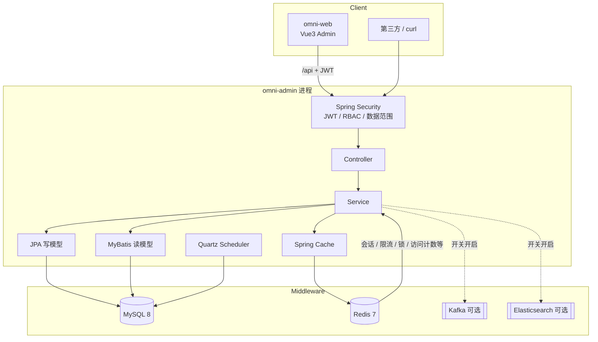

# Omni Scaffolding

Java 21 + Spring Boot 3.4 单体脚手架，面向高并发、高可用业务场景。默认开启虚拟线程，采用 **JPA（写/简单 CRUD）+ MyBatis-Plus（复杂查询）** 双轨持久化。

| 项 | 说明 |
|----|------|
| 形态 | 单体多模块（Maven），后端 `omni-admin` 启动；前端独立 `omni-web`（Vue 3） |
| API 前缀 | `/api/**`（JWT）；文档 `/swagger-ui.html` |
| 默认账号 | `admin` / `admin123` |

## 技术栈

| 层级 | 选型 |
|------|------|
| Runtime | Java 21 LTS + Virtual Threads |
| Framework | Spring Boot 3.4 / Spring MVC |
| Persistence | Spring Data JPA + MyBatis-Plus + MySQL 8 + Flyway |
| Cache / Lock | Redis 7 |
| Messaging | Kafka（可选，默认关闭 `omni.kafka.enabled=false`） |
| Search | Elasticsearch（可选，默认关闭 `omni.elasticsearch.enabled=false`） |
| Scheduling | Quartz JDBC 集群（默认开启，多实例互斥） |
| Security | Spring Security + JWT + RBAC |
| Resilience | Resilience4j RateLimiter + Redis 分布式限流 |
| Observability | Actuator + Micrometer/Prometheus + TraceId 日志 |
| Frontend | Vue 3 + Vite + Element Plus + Pinia + Vue Router |
| Docs | springdoc-openapi (Swagger UI) |

---

## 系统架构

### 模块划分

```text
omni-scaffolding/                 # 父 POM（packaging=pom）
├── omni-common                   # 统一响应、异常、审计基类、缓存/Redis Key 常量、Excel 等
├── omni-framework                # VT、Security/JWT、Redis、限流、锁、XSS、可选 Kafka/ES、JPA/MyBatis 装配
├── omni-system                   # 用户/角色/菜单/部门/字典/参数/日志/任务/白名单/运维
├── omni-demo                     # 双轨持久化 / Kafka / ES 演示（可从 omni-admin 去掉依赖）
├── omni-quartz                   # Quartz JDBC 集群定时任务
├── omni-admin                    # 启动入口 + application.yml + Flyway + fat jar
└── omni-web                      # Vue3 管理端（Vite，独立于 Maven）
```

依赖方向：`admin → system/demo/quartz → framework → common`（禁止反向依赖）。  
仍打一个可运行 jar，不是微服务。

### 逻辑架构



### 请求链路

1. Tomcat 虚拟线程接收请求  
2. XSS 过滤 → JWT 认证 → 权限 / 数据范围  
3. Resilience4j + Redis 限流（按配置）  
4. Controller → Service  
5. **写**：JPA（审计、`@Version` 乐观锁）  
6. **复杂读**：MyBatis XML  
7. 统一 `ApiResponse` + TraceId 日志  

### 双轨持久化约定

1. **写操作优先 JPA**（实体生命周期、乐观锁 `@Version`、审计字段）  
2. **复杂读走 MyBatis**（多表 join、动态条件、聚合统计）  
3. 共用同一 `DataSource` / Druid 与 Spring 事务  
4. Schema 以 Flyway 为准；生产 `ddl-auto=validate`  
5. 连接池监控：`/druid/*`；勿为虚拟线程无脑放大池  

示例：

- JPA 写：`POST /api/demo/products`、`POST /api/system/users`  
- MyBatis 读：`GET /api/demo/products`、`GET /api/demo/products/stats/by-category`、`GET /api/system/users`  

### 安全与权限

- **认证**：JWT（无状态，便于水平扩展）  
- **授权**：菜单 / 按钮权限码（如 `system:config:edit`）  
- **数据范围**：`ALL` / `DEPT_AND_CHILD` / `DEPT` / `SELF`  
- **登录加签**：可选 HMAC（nonce 防重放 + IP 限流）  
- **IP 白名单**：`@IpWhitelist` + 表 `sys_ip_whitelist`（yaml 兜底）  
- **在线用户**：Redis 会话索引，支持踢下线  
- **前端水印**：系统参数 `sys.ui.watermark`（`true` / `false`）  

系统管理 RBAC（Flyway V5）：部门树、菜单/按钮权限、角色数据范围。用户列表按角色数据范围隔离。

### 主要业务能力

| 域 | 能力 |
|----|------|
| 系统管理 | 用户、角色、部门、岗位、菜单、字典、系统参数、通知公告 |
| 审计 | 登录日志、操作日志 |
| 调度 | `sys_job` 管理 + Quartz JDBC 集群；Bean 调用、Cron、执行日志 |
| 安全 | IP 白名单、今日访问统计、缓存刷新 |
| 运维 | Redis / MySQL / 服务器信息 / Druid 监控页 |
| 演示 | 商品 CRUD、分布式锁、可选 Kafka / ES |

---

## 中间件

### 总览

| 中间件 | 版本（Compose） | 是否必需 | 用途 |
|--------|-----------------|----------|------|
| MySQL | 8.4 | **必需** | 业务库、Flyway、Quartz `QRTZ_*` |
| Redis | 7 Alpine | **必需** | Cache、会话、限流、锁、白名单访问计数 |
| Kafka | Bitnami 3.9 | 可选（profile） | 演示事件总线 |
| Elasticsearch | 8.17.0 | 可选（profile） | 演示商品检索 |

| 开关 | 默认 | 说明 |
|------|------|------|
| `omni.kafka.enabled` / `OMNI_KAFKA_ENABLED` | `false` | 关闭时排除 Kafka 自动配置 |
| `omni.elasticsearch.enabled` / `OMNI_ELASTICSEARCH_ENABLED` | `false` | 关闭时排除 ES 自动配置与健康检查 |
| `omni.quartz.enabled` / `OMNI_QUARTZ_ENABLED` | `true` | 关闭时排除 Quartz |

### MySQL

- 库名默认：`omni`；开发账号：`omni` / `omni`  
- 字符集：`utf8mb4`；时区：`+08:00`  
- Schema **只走 Flyway**（`omni-admin/src/main/resources/db/migration`）  
- 生产：`useSSL=true`，账号密码用环境变量注入  

### Redis

| 场景 | 说明 |
|------|------|
| Spring Cache | `sysConfig`、`ipWhitelist`、`users`、`userPermissions`、`dictOptions` 等，默认 TTL 10 分钟 |
| 在线会话 | `omni:online:*` |
| 登录防重放 / IP 限流 | `login:nonce:*`、`login:ip:*` |
| 分布式锁 | 如 `lock:product:sku:*` |
| IP 白名单访问计数 | `omni:ipwl:{yyyyMMdd}:{ip}` |

Key / 缓存名常量：`RedisKeys`、`CacheNames`、`ConfigKeys`（`com.omni.scaffolding.common.cache`）。

### Kafka（可选）

默认 **关闭**，不连 Broker，不影响无 Kafka 场景启动。

```bash
# 1. 启动 Kafka（Compose profile）
docker compose --profile kafka up -d

# 2. 打开开关（环境变量或 application-dev.yml）
# OMNI_KAFKA_ENABLED=true
# KAFKA_BOOTSTRAP_SERVERS=localhost:9092
```

```yaml
omni:
  kafka:
    enabled: true
    demo-topic: omni.demo.events
spring:
  kafka:
    bootstrap-servers: localhost:9092
```

演示发送（需登录）：`POST /api/demo/kafka/publish`  
关闭时由 `KafkaEnableEnvironmentPostProcessor` 自动排除 `KafkaAutoConfiguration`。

```bash
# EmbeddedKafka 单测
mvn -s .mvn/settings.xml -pl omni-admin -am -Dtest=DemoKafkaIntegrationTest -Dsurefire.failIfNoSpecifiedTests=false test
```

### Elasticsearch（可选）

默认 **关闭**，不连集群，不影响无 ES 场景启动。

```bash
docker compose --profile elasticsearch up -d
# OMNI_ELASTICSEARCH_ENABLED=true
# ELASTICSEARCH_URIS=http://localhost:9200
```

```yaml
omni:
  elasticsearch:
    enabled: true
    product-index: omni_demo_product
spring:
  elasticsearch:
    uris: http://localhost:9200
```

演示（需登录）：

- 全量重建索引：`POST /api/demo/es/products/reindex`  
- ES 搜索：`GET /api/demo/es/products/search?keyword=Java`  
- 创建商品时若 ES 已启用会自动写入索引  

关闭时由 `ElasticsearchEnableEnvironmentPostProcessor` 排除 ES 自动配置与 Health。

### Quartz 集群定时任务

多实例部署时，内存调度会每台各跑一遍。本脚手架使用 **Quartz + MySQL JDBC JobStore + `isClustered=true`**：各节点共享 `QRTZ_*` 表，同一 Trigger 同一时刻只被一台触发。

```yaml
omni:
  quartz:
    enabled: true                 # false 可完全关闭 Scheduler
    demo-job-enabled: true        # 演示心跳任务（每分钟）
    demo-cron: "0 * * * * ?"
spring:
  quartz:
    job-store-type: jdbc
    jdbc:
      initialize-schema: never    # 表结构走 Flyway V3，禁止自动删建
```

关闭：`OMNI_QUARTZ_ENABLED=false`（会排除 `QuartzAutoConfiguration`）。  
管理端维护 `sys_job`，运行时同步到 Scheduler。  
验证多实例：起两台相同服务，同一分钟应只有一台打印心跳 / 触发任务。长任务请加 `@DisallowConcurrentExecution`，业务逻辑须幂等。

### 可观测性

| 端点 | 用途 |
|------|------|
| `/actuator/health/liveness` | 存活探针 |
| `/actuator/health/readiness` | 就绪探针 |
| `/actuator/prometheus` | Prometheus 指标 |
| 日志 `X-Trace-Id` | 全链路追踪 ID（未传则自动生成） |
| `/druid` | 数据源监控（账号见配置） |

---

## 部署

### 环境要求

| 组件 | 建议 |
|------|------|
| JDK | 21+ |
| Maven | 3.9+（可用仓库内 `.mvn/settings.xml`） |
| Node.js | 20+（前端） |
| Docker | 用于中间件 / 一键部署 |
| 内存 | 本地开发建议 ≥ 8GB；ES 单节点额外预留约 1GB |

### 快速启动（本地开发）

**1. 依赖服务**

```bash
docker compose up -d mysql redis
```

**2. 启动后端**

```bash
# Windows PowerShell（建议 JDK 21 + 阿里云 Maven 镜像）
$env:JAVA_HOME = "C:\path\to\jdk-21"
mvn -s .mvn/settings.xml -pl omni-admin -am spring-boot:run
```

默认配置见 `omni-admin/src/main/resources/application-dev.yml`：

- DB: `localhost:3306/omni` / `omni` / `omni`  
- Redis: `localhost:6379`  
- 端口: `8080`  

登录：

```bash
curl -X POST http://localhost:8080/api/auth/login \
  -H "Content-Type: application/json" \
  -d "{\"username\":\"admin\",\"password\":\"admin123\"}"
```

Swagger UI: [http://localhost:8080/swagger-ui.html](http://localhost:8080/swagger-ui.html)

**3. 启动前端**

```bash
cd omni-web
npm install
npm run dev
```

- 地址：[http://localhost:5173](http://localhost:5173)  
- 开发代理：`/api` → `http://localhost:8080`  
- 本地需准备 `omni-web/.env.development`（已被 `.gitignore` 忽略）：

```env
VITE_APP_TITLE=Omni Admin
VITE_API_BASE=/api
VITE_OMNI_SIGN_SECRET=<与后端 omni.security.sign.secret 一致>
```

### Docker 一键部署（后端 + 中间件）

```bash
mvn -s .mvn/settings.xml -DskipTests package
docker compose up -d --build
```

- 应用镜像：`eclipse-temurin:21-jre-alpine`，非 root 用户  
- 入口：`java $JAVA_OPTS -jar /app/app.jar`  
- 健康检查：`GET /actuator/health/readiness`  
- 对外端口：`8080`  

| 变量 | 说明 |
|------|------|
| `SPRING_PROFILES_ACTIVE` | `prod` |
| `DB_HOST` / `DB_PORT` / `DB_NAME` / `DB_USER` / `DB_PASSWORD` | 数据源 |
| `REDIS_HOST` / `REDIS_PORT` / `REDIS_PASSWORD` | Redis |
| `OMNI_JWT_SECRET` | JWT 密钥（**生产必须更换**） |

### 生产部署建议

1. **密钥**：`OMNI_JWT_SECRET`、`OMNI_SIGN_SECRET`、DB/Redis 密码、Druid 控制台账号均走环境变量，禁止入库。  
2. **水平扩展**：应用无状态（JWT）；多实例共享同一 MySQL + Redis；Quartz 必须 JDBC 集群。  
3. **连接池**：单实例 Druid `max-active` ≈ `floor(DB_max_connections * 0.7 / 实例数)`。  
4. **优雅停机**：`server.shutdown=graceful`；滚动发布配合 readiness。  
5. **前端**：`npm run build` 产物由 Nginx/CDN 托管，反代 `/api`、`/uploads`、`/druid` 到后端。  
6. **探针**：使用 liveness + readiness，勿仅探测根路径。  

示例 Nginx：

```nginx
server {
  listen 80;
  root /usr/share/nginx/html;   # omni-web dist
  location /api/ {
    proxy_pass http://omni-app:8080/api/;
    proxy_set_header Host $host;
    proxy_set_header X-Real-IP $remote_addr;
    proxy_set_header X-Forwarded-For $proxy_add_x_forwarded_for;
  }
  location /uploads/ {
    proxy_pass http://omni-app:8080/uploads/;
  }
  location / {
    try_files $uri $uri/ /index.html;
  }
}
```

### 多实例（含 Quartz）验证

1. 同一套 MySQL + Redis  
2. 启动两台 `omni-admin`（不同端口）  
3. 观察同一 Trigger 同一时刻仅一台执行  
4. 业务任务需幂等  

---

## 虚拟线程

```yaml
spring:
  threads:
    virtual:
      enabled: true
```

- 请求处理 / `@Async` 使用虚拟线程  
- CPU 密集任务使用 `cpuBoundExecutor`（平台线程池）  
- **不要**为了“更高并发”无脑放大连接池  

预发排查 pinning：`-Djdk.tracePinnedThreads=short`

## 连接池与背压调优

| 配置 | 建议起点 | 说明 |
|------|----------|------|
| 数据源 `max-active` / Hikari max | 20 | 按 DB `max_connections` 与实例数校准 |
| 获取连接超时 | 3000ms | 拿不到连接快速失败 |
| `spring.data.redis.timeout` | 2s | 避免 VT 无限等待 |
| `spring.data.redis.lettuce.pool.max-active` | 32 | Redis 连接上限 |
| `omni.rate-limit.limit-for-period` | 100/s | 入口限流（Redis 多实例一致） |
| `server.shutdown` | graceful | 滚动发布友好 |

```text
单实例连接池 max ≈ floor(DB_max_connections * 0.7 / app_instances)
```

## 高可用要点

- 无状态 JWT，便于水平扩展  
- `/actuator/health/liveness`、`/actuator/health/readiness`  
- `/actuator/prometheus` 指标拉取  
- 请求头 `X-Trace-Id` 全链路透传  
- Redis 分布式锁（创建商品按 SKU 互斥演示）  
- Quartz JDBC 集群：多实例定时任务不重复触发  
- 生产密钥用环境变量：`OMNI_JWT_SECRET`、`DB_*`、`REDIS_*`  

---

## 前端（omni-web）

管理端：Vue 3 + Vite + TypeScript + Element Plus。覆盖登录、动态菜单、按钮级权限，以及用户/角色/部门/菜单、系统参数、定时任务、IP 白名单、运维页等。

演示账号（密码均为 `admin123`）：

| 账号 | 角色数据范围 | 用户列表可见 |
|------|--------------|--------------|
| `admin` | ALL | 全部 |
| `rd_mgr` | DEPT_AND_CHILD（研发部） | `rd_mgr`、`rd_dev` |
| `sales1` | SELF | 仅自己 |

更多前端说明见 [omni-web/README.md](omni-web/README.md)。

---

## 配置与约定速查

| 约定 | 位置 / 说明 |
|------|-------------|
| 公共配置 | `omni-admin/src/main/resources/application.yml` |
| 开发 / 生产 | `application-dev.yml` / `application-prod.yml` |
| Flyway | `omni-admin/src/main/resources/db/migration` |
| 缓存名 | `CacheNames` |
| Redis Key | `RedisKeys` |
| 系统参数键 | `ConfigKeys`（如 `sys.ui.watermark`） |
| 权限码 | `模块:资源:动作`，菜单表 `sys_menu.perms` |
| 逻辑删除 | 字段 `deleted`：0 正常 / 1 删除 |
| Compose / 镜像 | `docker-compose.yml`、`Dockerfile` |

## 常用端点

| Method | Path | 说明 |
|--------|------|------|
| POST | `/api/auth/login` | 登录 |
| GET | `/api/system/users/{id}` | 用户详情（含角色权限） |
| POST | `/api/demo/products` | JPA 创建商品 |
| GET | `/api/demo/products` | MyBatis 动态查询 |
| GET | `/api/demo/products/stats/by-category` | MyBatis 聚合 |
| POST | `/api/demo/kafka/publish` | Kafka 演示发送（需启用） |
| POST | `/api/demo/es/products/reindex` | ES 全量重建索引（需启用） |
| GET | `/api/demo/es/products/search` | ES 搜索商品（需启用） |
| GET | `/actuator/health` | 健康检查 |
| GET | `/actuator/prometheus` | Prometheus 指标 |

## 注释约定

- 包级：`package-info.java` 说明模块职责与强制约定（尤其双轨持久化）  
- 类级：写清「为什么存在 / 和谁配合 / 使用边界」  
- **实体 / DTO 字段**：每个字段写清业务含义、单位、枚举取值或约束  
- 公开与私有方法：摘要 + `@param` / `@return`（有意义时）  
- 不为 getter/setter 或显而易见的一行逻辑刷注释  

## 测试

```bash
mvn -s .mvn/settings.xml test
```

测试 profile 使用 H2（MySQL 模式）+ 简易缓存，并 mock Redis 依赖。集成测试在 `omni-admin`，JWT 单测在 `omni-framework`。
