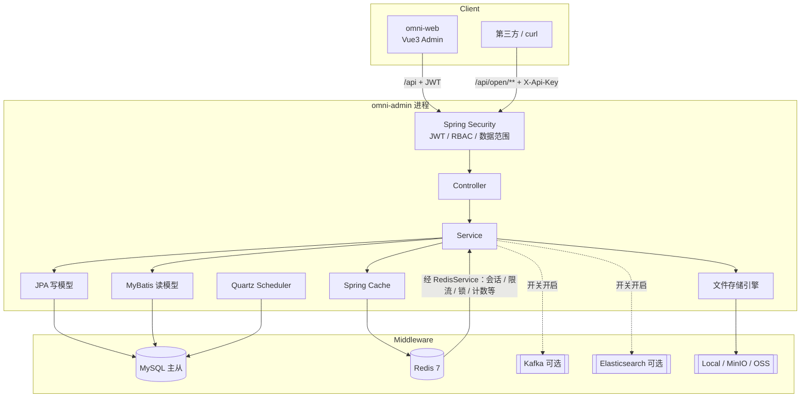

# Omni Scaffolding

Java 21 + Spring Boot 3.4 单体脚手架，面向高并发、高可用业务场景。默认开启虚拟线程，采用 **JPA（写/简单 CRUD）+ MyBatis-Plus（复杂查询）** 双轨持久化。

| 项 | 说明 |
|----|------|
| 形态 | 单体多模块（Maven），后端 `omni-admin` 启动；前端独立 `omni-web`（Vue 3） |
| API 前缀 | `/api/**`（JWT）；文档 `/swagger-ui.html` |
| 默认账号 | `admin` / `admin123` |
| AI / 协作者规范 | **[AGENTS.md](./AGENTS.md)**（强制）；Cursor 规则见 [`.cursor/rules/`](./.cursor/rules/) |

### 文档导航

| 文档 | 用途 |
|------|------|
| [AGENTS.md](./AGENTS.md) | **AI / 贡献者强制规范**：模块边界、双轨持久化、`saveAndFlush`、CRUD 清单、权限与前端约定 |
| [docs/ADOPT.md](./docs/ADOPT.md) | **换皮 / 裁剪清单**：改包名、去 demo、生产安全配置 |
| [docs/DEPLOY.md](./docs/DEPLOY.md) | **生产部署**：Nginx 反代、Jenkins 脚本、CORS / 环境变量 |
| [omni-web/README.md](./omni-web/README.md) | 管理端前端启动与目录说明 |
| `.env.example` | Compose / 生产环境变量模板 |
| `omni-admin/.../application*.yml` | 运行时配置（dev / prod / 公共） |

---

## 技术栈

| 层级 | 选型 |
|------|------|
| Runtime | Java 21 LTS + Virtual Threads |
| Framework | Spring Boot 3.4 / Spring MVC |
| Persistence | Spring Data JPA + MyBatis-Plus + MySQL 8 + Flyway + dynamic-datasource（主从） |
| Cache / Lock | Redis 7 |
| Object Storage | Local / MinIO / 可插拔 OSS（默认 Local） |
| Messaging | Kafka（可选，默认关闭 `omni.kafka.enabled=false`） |
| Search | Elasticsearch（可选，默认关闭 `omni.elasticsearch.enabled=false`） |
| Scheduling | Quartz JDBC 集群（默认开启，多实例互斥） |
| Security | Spring Security + JWT + RBAC + 数据范围 + XSS |
| Resilience | Resilience4j RateLimiter + Redis 分布式限流 |
| Observability | Actuator + Micrometer/Prometheus + TraceId 日志 |
| Frontend | Vue 3 + Vite + Element Plus + Pinia + Vue Router |
| Docs | springdoc-openapi (Swagger UI) |

---

## 系统架构

### 模块划分

```text
omni-scaffolding/                 # 父 POM（packaging=pom）
├── omni-common                   # 统一响应、异常、审计基类、缓存/Redis Key、Excel、文件 SPI 等
├── omni-framework                # VT、Security/JWT、Redis、限流、锁、XSS、可选 Kafka/ES、JPA/MyBatis、存储实现
├── omni-modules                  # 业务模块：system / open（开放 API）/ ops / tool.gen
├── omni-demo                     # 双轨持久化 / Kafka / ES 演示（可从 omni-admin 去掉依赖）
├── omni-quartz                   # Quartz JDBC 集群定时任务
├── omni-admin                    # 启动入口 + application.yml + Flyway + fat jar
├── omni-web                      # Vue3 管理端（Vite，独立于 Maven）
├── AGENTS.md                     # AI / 协作者开发规范
└── .cursor/rules/                # Cursor 规则（指向 AGENTS.md 要点）
```

依赖方向：`admin → modules/demo/quartz → framework → common`（禁止反向依赖）。  
仍打一个可运行 jar，不是微服务。

业务包根：`com.omni.scaffolding.modules.*`；系统域 DTO 按聚合分包（如 `dto.user` / `dto.role` / `dto.file` / `dto.client`），勿再往 `dto` 根目录堆平铺类。

### 逻辑架构



### 请求链路

1. Tomcat 虚拟线程接收请求  
2. XSS 过滤 → JWT 认证（管理端）或开放 API Key 过滤（`/api/open/**`）→ 权限 / 数据范围  
3. Resilience4j + Redis 限流（按配置；开放 API 走独立 QPS / 日限额）  
4. Controller → Service  
5. **写**：JPA（审计、`@Version` 乐观锁）→ 主库  
6. **复杂读**：MyBatis XML → 从库（无从库时回落主库）  
7. 统一 `ApiResponse` + TraceId 日志  

### 双轨持久化约定

1. **写操作优先 JPA**（实体生命周期、乐观锁 `@Version`、审计字段）→ **主库 `master`**  
2. **复杂读走 MyBatis**（多表 join、动态条件、聚合统计，`*QueryMapper`）→ **从库 `slave`**  
3. 主从通过 `dynamic-datasource` + Druid；JPA 读默认仍走主库，避免复制延迟  
4. **`*QueryMapper` 写方法**（`insert` / `delete` / `update` / `clear`）**留在主库**；仅 `find/list/search/count/...` 切从库（见 `ReadWriteDataSourceAspect`）  
5. **同事务内 JPA 写后立刻 MyBatis 读/写关联**：必须 `repository.saveAndFlush(...)`，否则会出现外键失败或详情读空  
6. Schema 以 Flyway 为准（始终打主库）；生产 `ddl-auto=validate`；**禁止修改已发布的 `V*` 脚本**，只新增版本  
7. 连接池监控：`/druid/*`；主+从各一池，勿为虚拟线程无脑放大  

**单库怎么配：**

| 场景 | 建议 |
|------|------|
| 本地 / Compose 单实例 | **只注册 `master`**（`application-dev.yml` / `application-test.yml` 已如此）；`strict=false` 时读路由回落主库 |
| 真实主从 | 配置 `DB_SLAVE_*`，并在对应 profile 增加 `slave` 数据源（可读库加 `lazy: true` 减轻启动） |
| 勿做 | 给 master 再配一个同址 slave（双池翻倍，启动可多卡十几秒） |

示例：

- JPA 写：`POST /api/demo/products`、`POST /api/system/users`  
- MyBatis 读：`GET /api/demo/products`、`GET /api/system/users`  
- JPA + MyBatis 关联：创建用户后 `saveAndFlush`，再写 `sys_user_role`  

更细的 CRUD 清单与踩坑表见 [AGENTS.md](./AGENTS.md)。

### 主从读写分离

| 节点 | 用途 | 环境变量 |
|------|------|----------|
| `master` | 写、Flyway、Quartz、JPA | `DB_HOST` / `DB_PORT` / `DB_NAME` / `DB_USER` / `DB_PASSWORD` |
| `slave` | MyBatis 复杂读 | `DB_SLAVE_HOST` 等（生产可配；缺省可与主库同址，但开发建议不注册） |

### 安全与权限

- **认证**：JWT（无状态，便于水平扩展）  
- **登录验证码**：图形验证码（Redis 一次性）；`OMNI_SECURITY_CAPTCHA_ENABLED`  
- **登录锁定**：连续失败按用户名锁定；`omni.security.login-lock.*`  
- **并发登录**：同账号最大同时在线设备数，超限踢最旧；YAML `omni.security.session-limit.*`，运行时可由系统参数 `sys.security.session-limit.enabled` / `sys.security.session-limit.max-devices` 覆盖（关闭或 `max-devices≤0` 不限制）  
- **密码策略**：复杂度 + 新建/重置强制改密；`omni.security.password-policy.*`  
- **授权**：菜单 / 按钮权限码（如 `system:config:edit`），与前端 `v-permission`、`@PreAuthorize` 同字符串  
- **数据范围**：`ALL` / `DEPT_AND_CHILD` / `DEPT` / `SELF`  
- **登录加签**：可选 HMAC（nonce 防重放 + IP 限流）  
- **IP 白名单**：`@IpWhitelist` + 表 `sys_ip_whitelist`（yaml 兜底）  
- **在线用户**：Redis 会话索引，支持踢下线  
- **开放 API**：`X-Api-Key` 鉴权、接口目录绑定、IP 白名单、QPS / 日限额（`modules.open`）  
- **前端水印**：系统参数 `sys.ui.watermark`（`true` / `false`）  

系统管理 RBAC（Flyway **V1** 初始化）：部门树、菜单/按钮权限、角色数据范围；用户列表按角色数据范围隔离。

### 主要业务能力

| 域 | 能力 |
|----|------|
| 系统管理 | 用户、角色、部门、岗位、菜单、字典、系统参数、通知公告、**统一文件管理** |
| 开放 API | 接口目录、客户端 Key 签发/重置、IP 白名单、接口绑定、当日用量 |
| 审计 | 登录日志、操作日志 |
| 调度 | `sys_job` 管理 + Quartz JDBC 集群；Bean 调用、Cron、执行日志 |
| 安全 | IP 白名单、今日访问统计、缓存刷新 |
| 运维 | Redis / MySQL / 服务器信息 / Druid 监控页 |
| 工具 | 在线代码生成（`tool.gen`，非 prod） |
| 演示 | 商品 CRUD、分布式锁、可选 Kafka / ES |
| 扩展点 | 文件 OSS 插件；通知通道 `NotifyChannel`（公告发布默认写日志） |

### Schema 迁移（Flyway）

| 版本 | 内容 |
|------|------|
| `V1__init_schema.sql` | 系统表、RBAC、演示表、`sys_job`、**Quartz `QRTZ_*`**、种子数据 |
| `V2__sys_file.sql` | `sys_file`、用户头像改文件 ID、文件管理菜单 |
| `V3__user_password_policy.sql` | 用户强制改密 / 改密时间字段 |
| `V4__open_api.sql` | 开放 API 接口目录 / 客户端 / IP 与接口绑定、菜单权限、演示 `GET /api/open/demo/ping` |

- 生产路径：`omni-admin/src/main/resources/db/migration/`  
- 测试 H2：`omni-admin/src/test/resources/db/migration-h2/`（语义同步）  

### 统一文件存储

支持 **Local / MinIO / 可插拔 OSS**（首发阿里云；七牛等实现 `OssProviderPlugin` 即可扩展）。

| 配置 | 说明 |
|------|------|
| `omni.file.storage-type` | `local`（默认）/ `minio` / `oss` |
| `omni.file.oss.provider` | OSS 插件 id，如 `aliyun` |
| `omni.file.local.base-dir` | 本地根目录（`OMNI_UPLOAD_DIR`） |
| `OMNI_MINIO_*` / `OMNI_OSS_ALIYUN_*` | MinIO / 阿里云凭证 |

- 元数据表：`sys_file`；业务字段统一存 **文件 ID**（如 `sys_user.avatar_file_id`）
- 上传：`POST /api/system/files?bizType=avatar`
- 内容：`GET /api/system/files/{id}/content`（JWT **或** `expire`+`sign` 短时签名）
- 预览：`GET /api/system/files/{id}/preview-url`；管理页 `/system/file` 支持图片预览
- **扩展 OSS**：实现 `OssProviderPlugin`（`providerId`）注册为 Spring Bean，配置 `omni.file.oss.provider` 与 `omni.file.oss.providers.<id>.*`
- **不要**再依赖匿名静态 `/uploads` 目录映射

---

## 中间件

### 总览

| 中间件 | 版本（Compose） | 是否必需 | 用途 |
|--------|-----------------|----------|------|
| MySQL | 8.4 | **必需** | 业务库、Flyway、Quartz `QRTZ_*` |
| Redis | 7 Alpine | **必需** | Cache、会话、限流、锁、白名单/开放 API 计数 |
| Kafka | Bitnami 3.9 | 可选（profile） | 演示事件总线 |
| Elasticsearch | 8.17.0 | 可选（profile） | 演示商品检索 |

| 开关 | 默认 | 说明 |
|------|------|------|
| `omni.kafka.enabled` / `OMNI_KAFKA_ENABLED` | `false` | 关闭时排除 Kafka 自动配置 |
| `omni.elasticsearch.enabled` / `OMNI_ELASTICSEARCH_ENABLED` | `false` | 关闭时排除 ES 自动配置与健康检查 |
| `omni.quartz.enabled` / `OMNI_QUARTZ_ENABLED` | `true` | 关闭时排除 Quartz |

### MySQL

- **Compose 默认**：库名 `omni`，账号 `omni` /（见 `.env`）  
- **开发 profile**：以 `application-dev.yml` 的 `DB_*` 为准（可用环境变量覆盖）  
- 字符集：`utf8mb4`；时区：`+08:00`  
- Schema **只走 Flyway**，始终连接主库  
- JDBC URL 建议带 `openTelemetry=DISABLED`（Connector/J 9 默认 PREFERRED，有 OTel API 时会对 IP reverse DNS，建连极慢）  
- 生产：`useSSL=true`，账号密码用环境变量注入  

### Redis

业务与基础设施 **统一通过 `RedisService`**（`omni-framework` / `infra.redis`）访问 Redis，不要在业务代码里直接注入 `StringRedisTemplate`。  
提供 get/set、NX、删除、TTL、自增/自减、`incrementAndExpireOnCreate`、Set/Hash、Lua、SCAN；运维控制台等复杂场景可用 `redisService.template()` 逃生。

| 场景 | 说明 |
|------|------|
| Spring Cache | `sysConfig`、`ipWhitelist`、`users`、`userPermissions`、`dictOptions` 等，默认 TTL 10 分钟 |
| 在线会话 | `omni:online:*` |
| 登录防重放 / 失败锁定 / 验证码 | `login:nonce:*`、`login:fail:*`、`login:captcha:*` 等 |
| 入口 / 业务限流 | `rl:*`（`RedisRateLimiter` 固定窗口；超限回滚计数） |
| 分布式锁 | 如 `lock:product:sku:*`（`DistributedLockService`） |
| IP 白名单访问计数 | `omni:ipwl:{yyyyMMdd}:{ip}` |
| 开放 API 限额 | 业务 Key 见 `RedisKeys.openApiQps` / `openApiDay`（限流器再加 `rl:` 前缀） |

Key / 缓存名常量：`RedisKeys`、`CacheNames`、`ConfigKeys`（`com.omni.scaffolding.common.cache`）。  
对照实现：`RedisService`、`RedisRateLimiter`、`OnlineSessionService`、`CaptchaService`。

### Kafka（可选）

默认 **关闭**，不连 Broker，不影响无 Kafka 场景启动。

```bash
# 1. 启动 Kafka（Compose profile）
docker compose --profile kafka up -d

# 2. 打开开关（环境变量或 application-dev.yml）
# OMNI_KAFKA_ENABLED=true
# KAFKA_BOOTSTRAP_SERVERS=localhost:9092
```

```yaml
omni:
  kafka:
    enabled: true
    demo-topic: omni.demo.events
spring:
  kafka:
    bootstrap-servers: localhost:9092
```

演示发送（需登录）：`POST /api/demo/kafka/publish`  
关闭时由 `KafkaEnableEnvironmentPostProcessor` 自动排除 `KafkaAutoConfiguration`。

```bash
# EmbeddedKafka 单测
mvn -s .mvn/settings.xml -pl omni-admin -am -Dtest=DemoKafkaIntegrationTest -Dsurefire.failIfNoSpecifiedTests=false test
```

### Elasticsearch（可选）

默认 **关闭**，不连集群，不影响无 ES 场景启动。

```bash
docker compose --profile elasticsearch up -d
# OMNI_ELASTICSEARCH_ENABLED=true
# ELASTICSEARCH_URIS=http://localhost:9200
```

```yaml
omni:
  elasticsearch:
    enabled: true
    product-index: omni_demo_product
spring:
  elasticsearch:
    uris: http://localhost:9200
```

演示（需登录）：

- 全量重建索引：`POST /api/demo/es/products/reindex`  
- ES 搜索：`GET /api/demo/es/products/search?keyword=Java`  
- 创建商品时若 ES 已启用会自动写入索引  

关闭时由 `ElasticsearchEnableEnvironmentPostProcessor` 排除 ES 自动配置与 Health。

### Quartz 集群定时任务

多实例部署时，内存调度会每台各跑一遍。本脚手架使用 **Quartz + MySQL JDBC JobStore + `isClustered=true`**：各节点共享 `QRTZ_*` 表，同一 Trigger 同一时刻只被一台触发。

```yaml
omni:
  quartz:
    enabled: true                  # false 可完全关闭 Scheduler
    demo-job-enabled: false        # 演示心跳默认关闭；请用「系统管理-定时任务」配置
    demo-cron: "0 * * * * ?"
spring:
  quartz:
    job-store-type: jdbc
    jdbc:
      initialize-schema: never     # 表结构在 Flyway V1，禁止自动删建
```

关闭：`OMNI_QUARTZ_ENABLED=false`（会排除 `QuartzAutoConfiguration`）。  
管理端维护 `sys_job`，启动时同步到 Scheduler。  
验证多实例：起两台相同服务，同一分钟应只有一台触发。长任务请加 `@DisallowConcurrentExecution`，业务逻辑须幂等。

**表名大小写：** Quartz 查询的是 `QRTZ_JOB_DETAILS` 等**全大写**表名。Linux MySQL（`lower_case_table_names=0`）若建成 `qrtz_*` 小写会报不存在；仅改名后外键仍可能指向小写表，统一执行 [`sql/fix_qrtz_uppercase.sql`](./sql/fix_qrtz_uppercase.sql)（会清空 QRTZ 运行时数据，`sys_job` 保留，重启后自动同步），再重启应用。

### 可观测性

| 端点 | 用途 |
|------|------|
| `/actuator/health/liveness` | 存活探针 |
| `/actuator/health/readiness` | 就绪探针 |
| `/actuator/prometheus` | Prometheus 指标 |
| 日志 `X-Trace-Id` | 全链路追踪 ID（未传则自动生成） |
| `/druid` | 数据源监控（账号见配置） |

---

## 部署

### 环境要求

| 组件 | 建议 |
|------|------|
| JDK | 21+ |
| Maven | 3.9+（可用仓库内 `.mvn/settings.xml`） |
| Node.js | 20+（前端） |
| Docker | 用于中间件 / 一键部署 |
| 内存 | 本地开发建议 ≥ 8GB；ES 单节点额外预留约 1GB |

### 快速启动（本地开发）

**1. 依赖服务**

```bash
docker compose up -d mysql redis
```

**2. 启动后端**

```bash
# Windows PowerShell（建议 JDK 21 + 阿里云 Maven 镜像）
$env:JAVA_HOME = "C:\path\to\jdk-21"
# 若用 Compose 默认库，可覆盖开发 yml 中的远程默认值：
# $env:DB_HOST="127.0.0.1"; $env:DB_PORT="3306"; $env:DB_NAME="omni"
# $env:DB_USER="omni"; $env:DB_PASSWORD="你的密码"
# $env:REDIS_HOST="127.0.0.1"; $env:REDIS_PORT="6379"; $env:REDIS_PASSWORD="你的密码"
mvn -s .mvn/settings.xml -pl omni-admin -am spring-boot:run
```

默认配置见 `omni-admin/src/main/resources/application-dev.yml`：

- `DB_*` / `REDIS_*` 可用环境变量覆盖（文件内带开发机默认值，**换环境务必覆盖**）  
- 端口：`8080`  
- 单库开发默认只注册 `master`，连接池 `initial-size=1`，减轻启动耗时  

**启动偏慢时检查：**

1. JDBC URL 是否带 `openTelemetry=DISABLED`  
2. 是否误配了与 master 同址的 slave（双池翻倍）  
3. MySQL 网络 RTT / `skip_name_resolve`；是否误开 Kafka/ES  

登录：

```bash
curl -X POST http://localhost:8080/api/auth/login \
  -H "Content-Type: application/json" \
  -d "{\"username\":\"admin\",\"password\":\"admin123\"}"
```

Swagger UI: [http://localhost:8080/swagger-ui.html](http://localhost:8080/swagger-ui.html)

**3. 启动前端**

```bash
cd omni-web
npm install
npm run dev
```

- 地址：[http://localhost:5173](http://localhost:5173)  
- 开发代理：`/api` → `http://localhost:8080`  
- 本地需准备 `omni-web/.env.development`（已被 `.gitignore` 忽略）：

```env
VITE_APP_TITLE=Omni Admin
VITE_API_BASE=/api
VITE_OMNI_SIGN_SECRET=<与后端 omni.security.sign.secret 一致>
```

### Docker 一键部署（后端 + 中间件）

```bash
# 首次启动先复制并修改全部密码/密钥，.env 不可提交
# PowerShell: Copy-Item .env.example .env
# Linux/macOS: cp .env.example .env
mvn -s .mvn/settings.xml -DskipTests package
docker compose up -d --build
```

- 应用镜像：`eclipse-temurin:21-jre-alpine`，非 root 用户  
- 入口：`java $JAVA_OPTS -jar /app/app.jar`  
- 健康检查：`GET /actuator/health/readiness`  
- 对外端口：`8080`  

| 变量 | 说明 |
|------|------|
| `SPRING_PROFILES_ACTIVE` | `prod` |
| `DB_HOST` / `DB_PORT` / `DB_NAME` / `DB_USER` / `DB_PASSWORD` | 主库（写） |
| `DB_SLAVE_HOST` / `DB_SLAVE_PORT` / `DB_SLAVE_NAME` / `DB_SLAVE_USER` / `DB_SLAVE_PASSWORD` | 从库（读，可选；缺省=主库） |
| `REDIS_HOST` / `REDIS_PORT` / `REDIS_PASSWORD` | Redis |
| `OMNI_JWT_SECRET` | JWT 密钥（**生产必须更换**） |
| `OMNI_SIGN_SECRET` | 登录请求签名密钥（**生产必须更换**） |
| `OMNI_ADMIN_INITIAL_PASSWORD` | 首次生产启动替换 `admin/admin123`，至少 12 位 |
| `OMNI_CORS_ORIGINS` | 生产站点 Origin（含协议）；Nginx 同源反代也必配，多个逗号分隔 |
| `OMNI_FILE_STORAGE_TYPE` | `local` / `minio` / `oss` |
| `DRUID_ENABLED` | 生产默认 `false`；仅在内网监控场景显式开启 |
| `DRUID_ALLOW` | Druid 来源 IP/CIDR 白名单，默认仅 `127.0.0.1` |
| `DRUID_USERNAME` / `DRUID_PASSWORD` | Druid 独立账号，开启前必须设置强密码 |

完整列表见 [.env.example](./.env.example)。

### 生产部署建议

1. **密钥**：`OMNI_JWT_SECRET`、`OMNI_SIGN_SECRET`、DB/Redis 密码、Druid 控制台账号均走环境变量，禁止入库。  
2. **水平扩展**：应用无状态（JWT）；多实例共享同一 MySQL + Redis；Quartz 必须 JDBC 集群。  
3. **连接池**：主+从各一 Druid 池；单实例 `max-active` 总和 ≈ `floor(DB_max_connections * 0.7 / 实例数)`。  
4. **优雅停机**：`server.shutdown=graceful`；滚动发布配合 readiness。  
5. **前端**：`npm run build` 产物由 Nginx/CDN 托管，反代 `/api`、`/druid` 到后端。  
6. **CORS**：配置 `OMNI_CORS_ORIGINS` 与浏览器访问 Origin 一致（含协议）。  
7. **探针**：使用 liveness + readiness，勿仅探测根路径。  
8. **管理端点**：生产关闭 Swagger；Prometheus 不匿名开放；Druid 默认关闭，开启时同时配置内网路由、`DRUID_ALLOW` 与独立强密码。

完整 Nginx 配置与 Jenkins 启动脚本见 **[docs/DEPLOY.md](./docs/DEPLOY.md)**。

### 多实例（含 Quartz）验证

1. 同一套 MySQL + Redis  
2. 启动两台 `omni-admin`（不同端口）  
3. 观察同一 Trigger 同一时刻仅一台执行  
4. 业务任务需幂等  

---

## 虚拟线程

```yaml
spring:
  threads:
    virtual:
      enabled: true
```

- 请求处理 / `@Async` 使用虚拟线程  
- CPU 密集任务使用 `cpuBoundExecutor`（平台线程池）  
- **不要**为了“更高并发”无脑放大连接池  

预发排查 pinning：`-Djdk.tracePinnedThreads=short`

## 连接池与背压调优

| 配置 | 建议起点 | 说明 |
|------|----------|------|
| 数据源 `max-active` | 20 | 按 DB `max_connections` 与实例数校准（主+从各一池） |
| 获取连接超时 | 3000ms | 拿不到连接快速失败；开发可略加大 |
| `spring.data.redis.timeout` | 2s | 避免 VT 无限等待 |
| `spring.data.redis.lettuce.pool.max-active` | 32 | Redis 连接上限 |
| `omni.rate-limit.limit-for-period` | 100/s | 入口限流（Redis 多实例一致） |
| `server.shutdown` | graceful | 滚动发布友好 |

```text
单实例连接池 max ≈ floor(DB_max_connections * 0.7 / app_instances)
```

## 高可用要点

- 无状态 JWT，便于水平扩展  
- `/actuator/health/liveness`、`/actuator/health/readiness`  
- `/actuator/prometheus` 指标拉取  
- 请求头 `X-Trace-Id` 全链路透传  
- Redis 分布式锁（创建商品按 SKU 互斥演示）  
- Quartz JDBC 集群：多实例定时任务不重复触发  
- 生产密钥用环境变量：`OMNI_JWT_SECRET`、`DB_*`、`REDIS_*`  

---

## 前端（omni-web）

管理端：Vue 3 + Vite + TypeScript + Element Plus。覆盖登录、动态菜单、按钮级权限（`v-permission`）、**首页工作台**（快捷入口 + 未读公告 + 可选运行态），以及用户/角色/部门/菜单/岗位/字典/参数/公告/文件/定时任务/IP 白名单、**开放 API（接口目录 / 客户端）**、运维页、代码生成等。

演示账号（密码均为 `admin123`）：

| 账号 | 角色数据范围 | 用户列表可见 |
|------|--------------|--------------|
| `admin` | ALL | 全部 |
| `rd_mgr` | DEPT_AND_CHILD（研发部） | `rd_mgr`、`rd_dev` |
| `sales1` | SELF | 仅自己 |

更多前端说明见 [omni-web/README.md](omni-web/README.md)。  
新增页面请对照 `views/system/post/`，并遵守 [AGENTS.md](./AGENTS.md) §9。

---

## 配置与约定速查

| 约定 | 位置 / 说明 |
|------|-------------|
| AI 开发规范 | [AGENTS.md](./AGENTS.md)、[`.cursor/rules/`](./.cursor/rules/) |
| 公共配置 | `omni-admin/src/main/resources/application.yml` |
| 开发 / 生产 | `application-dev.yml` / `application-prod.yml` |
| Flyway | `omni-admin/src/main/resources/db/migration`（V1–V4；勿改已发布脚本） |
| 缓存名 | `CacheNames` |
| Redis 访问 | `RedisService`（禁止业务直接 `StringRedisTemplate`） |
| Redis Key | `RedisKeys` |
| 系统参数键 | `ConfigKeys`（如 `sys.ui.watermark`） |
| 权限码 | `模块:资源:动作`，菜单表 `sys_menu.perms` |
| 逻辑删除 | 字段 `deleted`：0 正常 / 1 删除 |
| 主键 | 业务侧 `IdGenerator.nextId()`，非 DB 自增 |
| Compose / 镜像 | `docker-compose.yml`、`Dockerfile`、`.env.example` |

## 常用端点

| Method | Path | 说明 |
|--------|------|------|
| POST | `/api/auth/login` | 登录 |
| GET | `/api/auth/me` | 当前用户 + 菜单 |
| GET | `/api/system/users/{id}` | 用户详情（含角色权限） |
| POST | `/api/system/files` | 上传文件 |
| GET | `/api/system/files/{id}/content` | 文件内容（JWT 或签名） |
| GET | `/api/system/files/{id}/preview-url` | 短时预览 URL |
| GET | `/api/open/admin/endpoints` | 开放 API 接口目录（JWT） |
| GET | `/api/open/admin/clients` | 开放 API 客户端管理（JWT） |
| GET | `/api/open/demo/ping` | 开放 API 演示（`X-Api-Key`） |
| POST | `/api/demo/products` | JPA 创建商品 |
| GET | `/api/demo/products` | MyBatis 动态查询 |
| GET | `/api/demo/products/stats/by-category` | MyBatis 聚合 |
| POST | `/api/demo/kafka/publish` | Kafka 演示发送（需启用） |
| POST | `/api/demo/es/products/reindex` | ES 全量重建索引（需启用） |
| GET | `/api/demo/es/products/search` | ES 搜索商品（需启用） |
| GET | `/actuator/health` | 健康检查 |
| GET | `/actuator/prometheus` | Prometheus 指标 |

## 注释约定

- 包级：`package-info.java` 说明模块职责与强制约定（尤其双轨持久化）  
- 类级：写清「为什么存在 / 和谁配合 / 使用边界」  
- **实体 / DTO 字段**：每个字段写清业务含义、单位、枚举取值或约束  
- 公开与私有方法：摘要 + `@param` / `@return`（有意义时）  
- 不为 getter/setter 或显而易见的一行逻辑刷注释  

## 测试

```bash
mvn -s .mvn/settings.xml test
```

测试 profile 使用 H2（MySQL 模式）+ 简易缓存，并 mock Redis 依赖。集成测试在 `omni-admin`，JWT / 存储等单测在 `omni-framework` / `omni-common`。

## 贡献与 AI 协作

1. 先读 **[AGENTS.md](./AGENTS.md)**，按其中的 CRUD 清单与自检表交付  
2. Cursor 用户会自动加载 `.cursor/rules/`；其他 AI 工具请把 `AGENTS.md` 放进上下文  
3. 对照模板：`Post*`（简单 CRUD）、`UserService`（主表+关联）、`FileService`（统一存储）  
4. PR 说明写清：迁移版本、权限码、是否改前端、如何验证  
